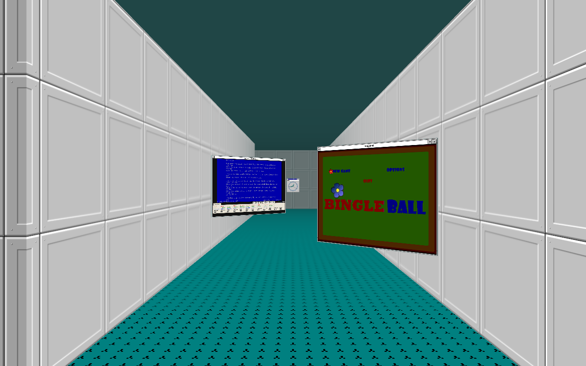
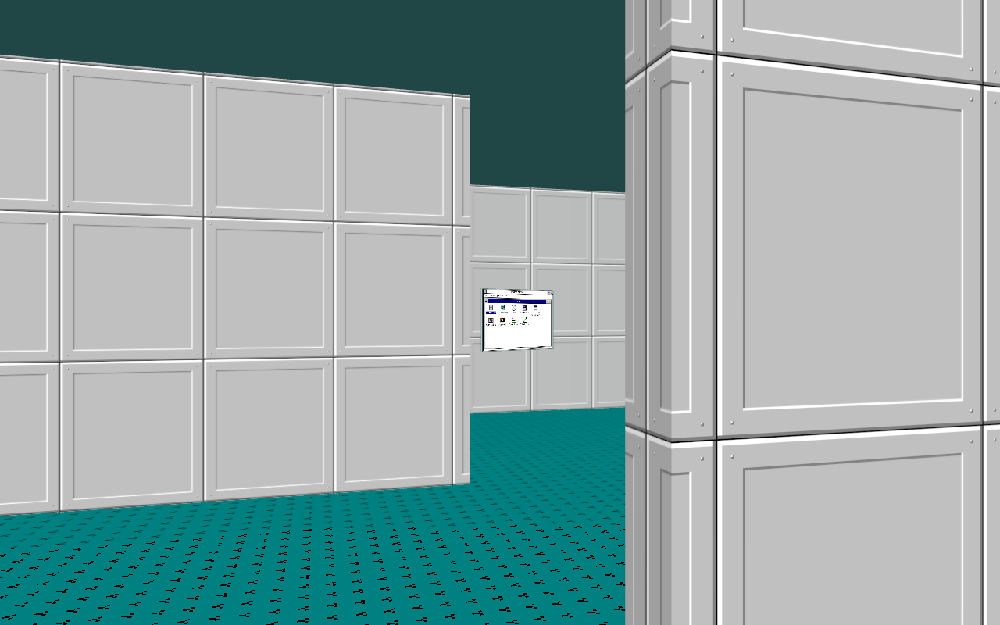
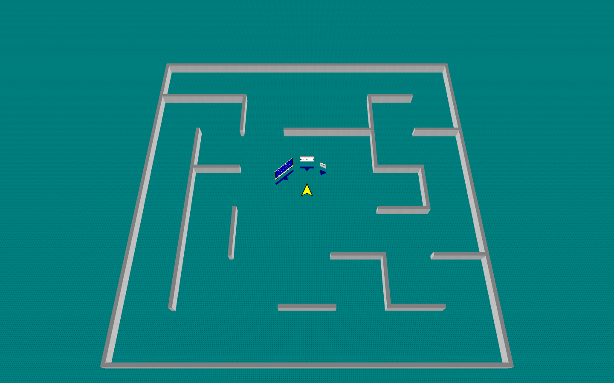

# Terrarium

A desktop in a maze. The windows stand on the floor of its corridors and
rooms; walk up to one to use it, step back to see them all from above.

## Running it

Static, no build. Three.js comes from a CDN import map.

    node tools/dev.mjs

serves this repo and its siblings (`hardreturn`, `bingleball`, `magnimarbles`,
`turtlebloom`, `webturtles`) from one origin at http://localhost:8077/, and
the shell frames the local copies. Deployed, it frames the deployed apps.

## Controls

The walking keys are the shell's while no app has the keyboard. Click the
floor or a wall to take it back from an app, or press Esc in a built-in
one (Program Manager, File Manager, Control Panel, Clock).

| | |
|---|---|
| ↑ / W, ↓ / S | walk forward, back |
| ← → | turn |
| A D, Shift+← Shift+→ (or Alt) | step sideways |
| drag the floor | turn, and look up or down |
| scroll on the floor | walk forward, back |
| click a title bar | walk up to that window and stand square in front of it |
| O, or Window ▸ Step Back | the map, with every window where it really stands and a mark on the floor for the way it faces; click a window or its mark to walk to it; O or Esc to come down |

Walls stop you; windows you walk into get knocked out of the way. Any
movement key stops a walk that's taking you somewhere.

## Using it

- Program Manager starts things: double-click an icon in Main (or select it
  and press Enter). A new window opens in front of you; one you already
  have open, you walk to rather than starting it again. Shift opens
  another. Program Manager's Window menu has Turn Left, Turn Right (a
  quarter turn each) and Step Back.
- Double-click the floor, or press Ctrl+Esc, for the Task List: Switch To
  (walks you there), End Task, Cascade (stacked in front of you, each
  further back), Tile (side by side around you) and Arrange Icons.
  Program Manager is always on it, so a closed one can come back.
- Pick a window up by its title bar. Drag across to move it across, up to
  push it away, down to pull it near. It stays where it is from you while
  you hold it, so you can walk or turn with it. Let go while it's moving
  and it's thrown. Hold Shift while you drag and up and down raise and
  lower it instead, or scroll while you hold it; scrolling on the bar
  does the same. Double-click the bar to maximize. Drag any edge or
  corner of the border to size it. Right-drag (or Alt-drag) the bar to
  turn it.
- ▼ minimizes a window to an icon along the bottom of the view, which goes
  where you go; click the icon for its control menu, double-click it to
  restore it in front of you. ▲ maximizes to fill the view; Restore puts it
  back where it stood.
- The box at the left of the title bar opens the control menu (Alt+Space
  when no app has the keyboard): Restore, Move and Size (with the arrow
  keys), Minimize, Maximize, Close (Ctrl+F4, or double-click the box),
  Switch To, and Turn Around, which shows the back of the window. You can
  write on the back; F5 puts in the time and date.
- Windows are solid. One that would pass through another is pushed back or
  aside instead, and a thrown one knocks the others about and bounces off
  the walls. Each casts a shadow on the floor, fainter the higher it
  floats, and is lit and fogged like the walls around it.
- File Manager shows the files as drive c:, opens them with their app, and
  imports, exports, renames and deletes. Files dropped onto the floor land
  in `c:\documents`.
- Control Panel ▸ Desktop sets the desktop color and the floor's pattern
  (the ceiling is the color, darker) and the walls: Panels, Brick or Stone.

Where you stand, the layout, the notes on the backs, the desktop, and the
files persist in the browser. A layout saved before the maze comes back
with its ring standing in the starting room.

## The marble

A Magnimarbles marble rolls on the floor of the maze. Click the floor to
put a magnet down (Shift-click for a blue one), click a magnet to flip it,
drag it to move it, Alt-click or right-click it to pick it up. Red pushes
the marble, blue pulls it; six can be down at once, and a seventh takes up
the oldest. The walls stop it, you kick it by walking into it, and a window
lowered far enough to meet it is a wall too, a bouncier one than the maze's,
and a paddle while it moves. Magnets slide: a low window or your feet shove
them, a window is knocked back by one, and they stop on the walls and on
each other. Drag the floor down to look down at it.

The marble's physics is Magnimarbles' own `src/physics.js`, imported from
a pinned commit through the import map in `index.html`; move the pin to
take a newer one.

## The maze

`MAZE` in `src/maze.js` holds the seed, the size in cells, the cell and
wall sizes, how many walls are knocked out for loops, the starting room
and how many other rooms. The same seed gives the same maze on every
visit. Walking speeds are `MOVE` in `src/player.js`; the map's angle and
how far its walls sink are at the top of `src/space.js`.

## Apps

An app is a page in a frame. It can talk to the shell over `postMessage`
to open and save files, set its title, and say when it has unsaved
changes: see [PROTOCOL.md](PROTOCOL.md). `tools/probe.html` is a minimal
app that speaks it.

## Tests

    node --test test/*.test.mjs

## Layout

- `src/space.js` the world: the camera, the maze in WebGL over the windows, occluders, floor, ceiling, the map
- `src/maze.js` the level: generation from a seed, walls as boxes and bodies, paths, rays, clear floor
- `src/player.js` you: walking, turning, and walking by yourself to somewhere
- `src/walls.js` Panels, Brick and Stone, drawn on a canvas
- `src/layout.js` saved layouts, and reading old ring ones into the maze
- `src/desktop.js` the desktop colors, patterns and walls
- `src/window.js` a window: frame, faces, edges, dragging, sizing, the control menu, its icon, its occluder
- `src/physics.js` windows, you and the walls as rigid bodies: impacts, spin, friction
- `src/shell.js` focus, walking to windows, minimizing and maximizing, Cascade and Tile, opening files, the protocol, saving the layout
- `src/menu.js` drop-down menus and menu bars
- `src/dialogs.js` message boxes, list boxes, combo boxes, the Task List
- `src/progman.js` Program Manager
- `src/files.js` File Manager, the Open and Save As dialog
- `src/clock.js`, `src/control.js` Clock, Control Panel
- `src/icons.js` pixel art in the sixteen VGA colors
- `src/fs.js` the filesystem, in IndexedDB
- `src/apps.js` what Program Manager can start
